<!DOCTYPE html>

<html>

<head>
    <meta charset="UTF-8">
    <title>Товары для подарка</title>
    
    
</head>

<body > 

 
    

       <a href="http://buyeasy.by/redirect/cpa/o/pjdrqujaxkrr4q4pqsewqlw10v0bbvcf/">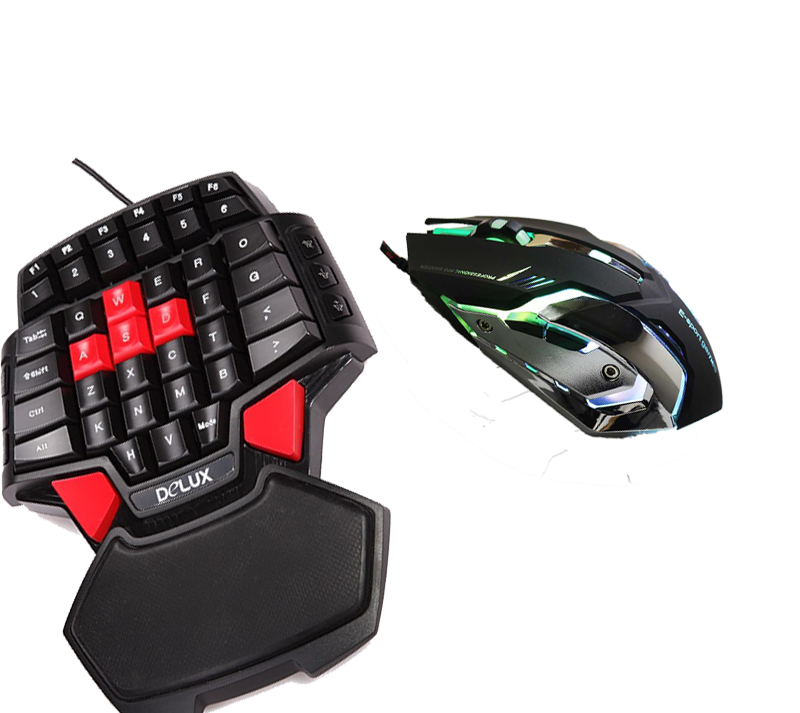 </a>      
       <a id="tr" class="tr"  href="#">1</a>
       <a id="tr1" class="tr" href="#" >2</a>
       <a id="tr2" class="tr" href="#" >3</a>
    

<button id="r"></button>

 
    

    <a href="http://buyeasy.by/redirect/cpa/o/pjex8wufup3ih92d1uybre2cpvcf9x6b/">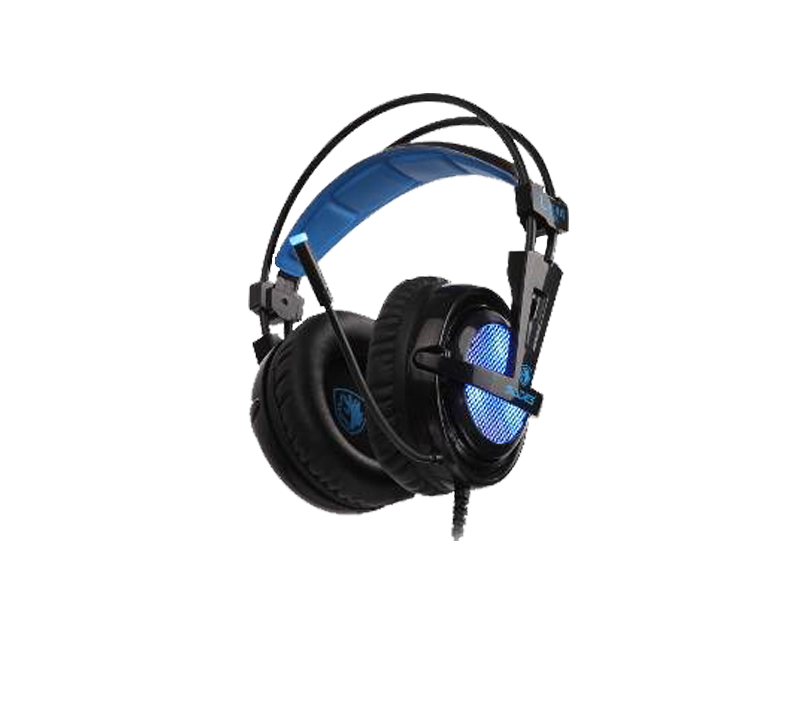 </a>       
    <a id="so1" class="tr"  href="#">1</a>
    <a id="so2" class="tr" href="#" >2</a>
    <a id="so3" class="tr" href="#" >3</a>
    

<button id="r1"></button>

 
   

   <a href="http://buyeasy.by/redirect/cpa/o/pjdq1el2wnqeio4di7pv4otwsxam1bns/">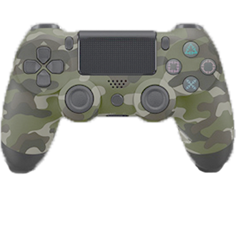 </a>       
   <a id="ps1" class="tr"  href="#">1</a>
   <a id="ps2" class="tr" href="#" >2</a>
   <a id="ps3" class="tr" href="#" >3</a>
    

<button id="r2"></button>
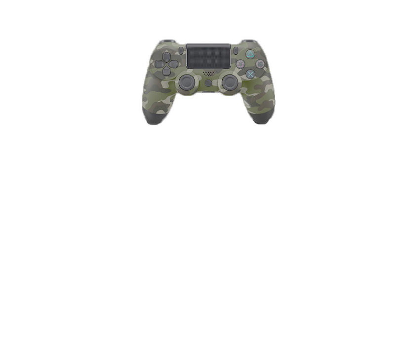

 
    

    <a href="http://buyeasy.by/redirect/cpa/o/pjdq1el2wnqeio4di7pv4otwsxam1bns/">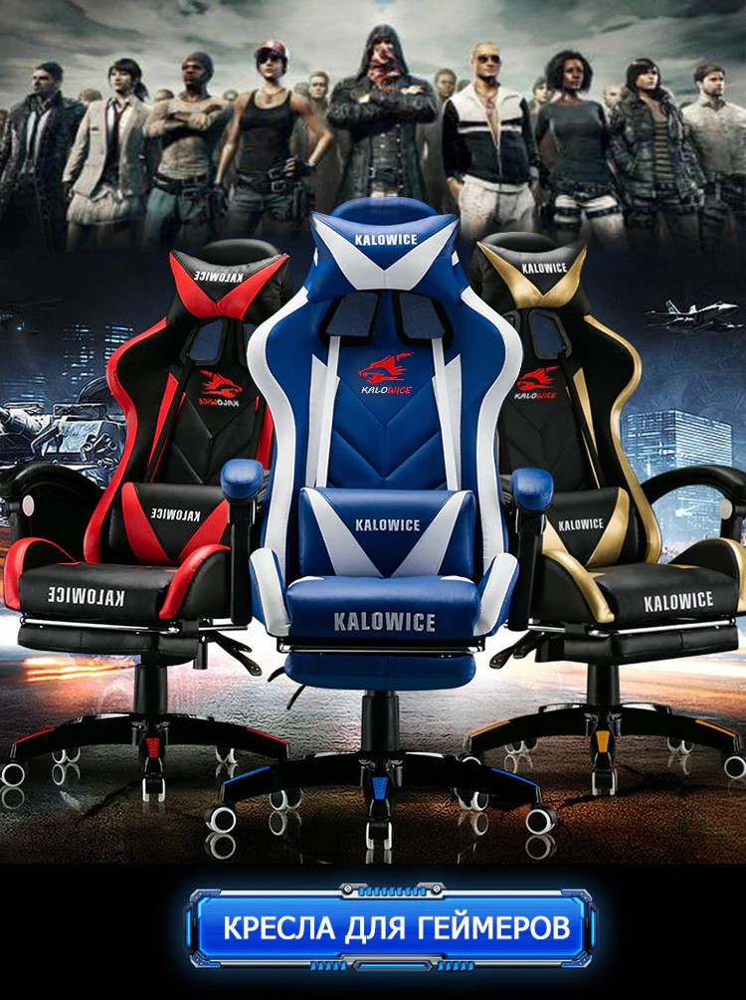 </a>          
    <a id="kres1" class="tr"  href="#">1</a>
    <a id="kres2" class="tr" href="#" >2</a>
    <a id="kres3" class="tr" href="#" >3</a>
    

 <button id="r3"></button>
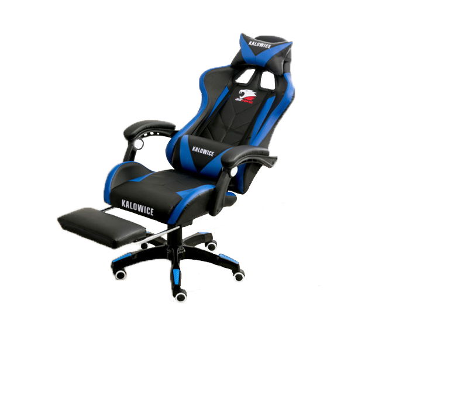

 
    

    <a href="http://buyeasy.by/redirect/cpa/o/pjdqy7qy1p0vmy7rd59x0k0ned0xuzzo/">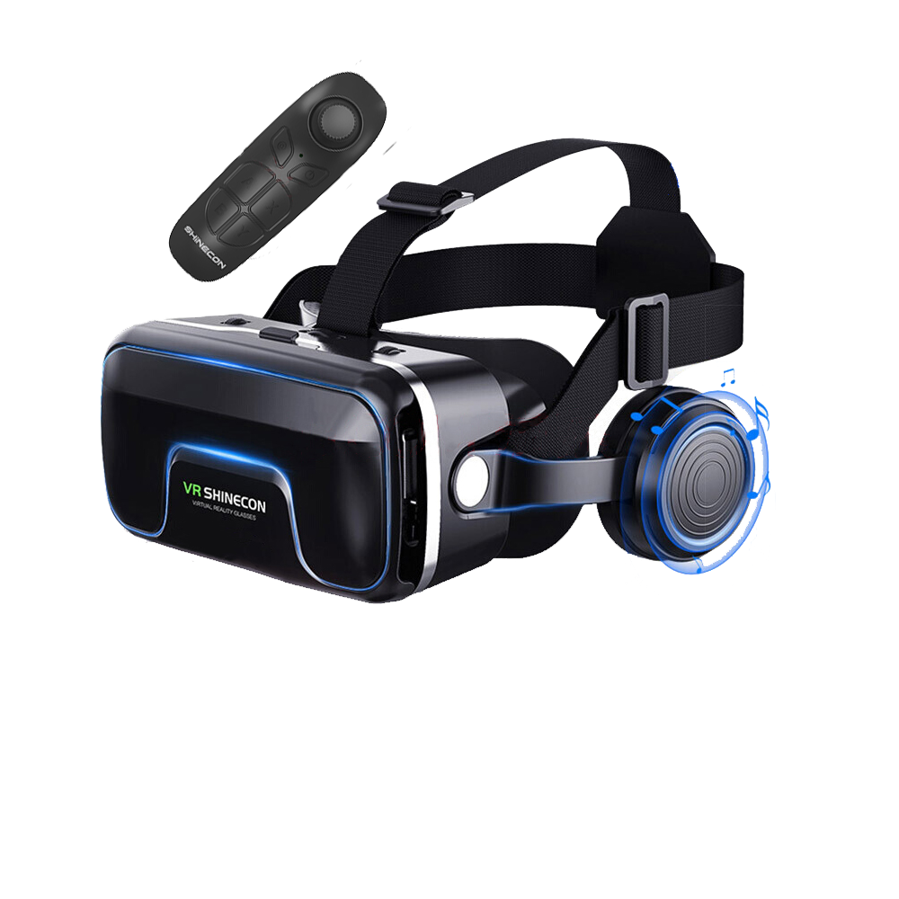 </a>       >  >  
    <a id="vr1" class="tr"  href="#">1</a>
    <a id="vr2" class="tr" href="#" >2</a>
    <a id="vr3" class="tr" href="#" >3</a>
    

 <button id="r4"></button>

    

        <a href="http://buyeasy.by/redirect/cpa/o/pjqe5y9tlmstv0h420daotf03a7kr3t1/">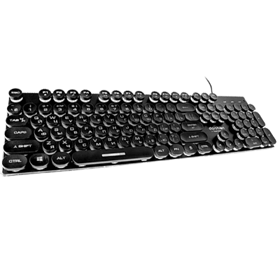</a>           
        <a id="KL1" class="tr" href="#">1</a>
        <a id="KL2" class="tr" href="#">2</a>
        <a id="KL3" class="tr" href="#">3</a>
    

<button id="r5"></button>

    

        <a href="http://buyeasy.by/redirect/cpa/o/pjqfxwwvqh9tqvl5hjd7liv2519fq4zq/">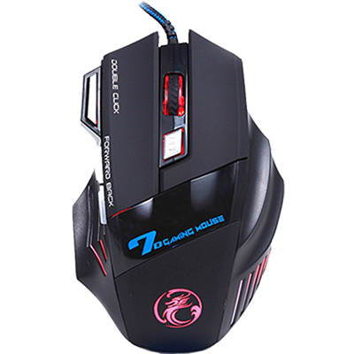</a>           
        <a id="mouse1" class="tr" href="#">1</a>
        <a id="mouse2" class="tr" href="#">2</a>
        <a id="mouse3" class="tr" href="#">3</a>
    

<button id="r6"></button>

    

        <a href="http://buyeasy.by/redirect/cpa/o/pjqmrq28bsquccl3itwi7m0ptolaax57/">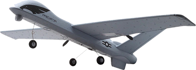</a>           
        <a id="planner1" class="tr" href="#">1</a>
        <a id="planner2" class="tr" href="#">2</a>
        <a id="planner3" class="tr" href="#">3</a>
    

<button id="r7"></button>

    

        <a href="http://buyeasy.by/redirect/cpa/o/pjqms4u83sjy3mxx1gn4nqzyt1rtjgwb/">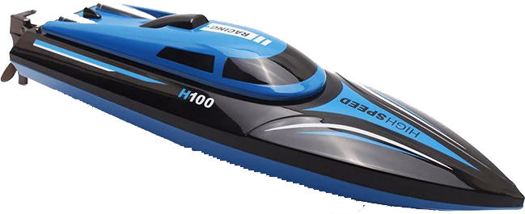</a>           
        <a id="lodka1" class="tr" href="#">1</a>
        <a id="lodka2" class="tr" href="#">2</a>
        <a id="lodka3" class="tr" href="#">3</a>
    

<button id="r8"></button>

    

                   
        <a id="ecsc1" class="tr" href="#">1</a>
        <a id="ecsc2" class="tr" href="#">2</a>
        <a id="ecsc3" class="tr" href="#">3</a>
    

<button id="r9"></button>

    

        <a href="http://buyeasy.by/redirect/cpa/o/pjqmsg270slizowy8kgxgrs0cx7bbtgj/">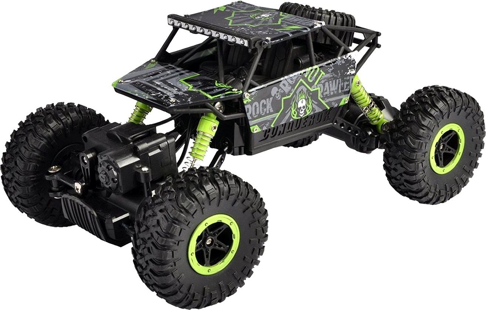</a>           
        <a id="bagi1" class="tr" href="#">1</a>
        <a id="bagi2" class="tr" href="#">2</a>
        <a id="bagi3" class="tr" href="#">3</a>
    

<button id="r10"></button>

    

        <a href="http://buyeasy.by/redirect/cpa/o/pjqmqnalry1rsayd64rs2xft1s31l0n1/">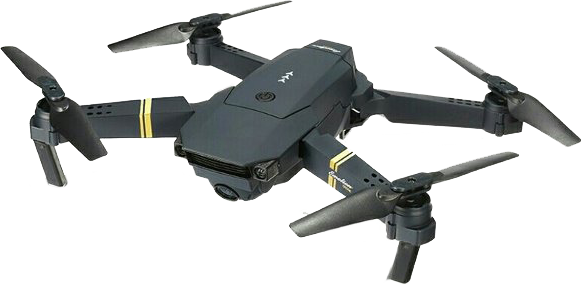</a>           
        <a id="rdflh1" class="tr" href="#">1</a>
        <a id="rdflh2" class="tr" href="#">2</a>
        <a id="rdflh3" class="tr" href="#">3</a>
    

<button id="r11"></button>

    

        <a href="http://buyeasy.by/redirect/cpa/o/pjqmr7ufhaar68mjng5i52uyi5rawhaf/">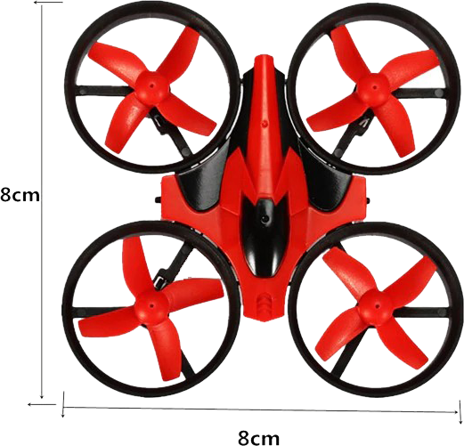</a>           
        <a id="kvadr1" class="tr" href="#">1</a>
        <a id="kvadr2" class="tr" href="#">2</a>
        <a id="kvadr3" class="tr" href="#">3</a>
    

<button id="r12"></button>

    

        <a href="http://buyeasy.by/redirect/cpa/o/pjssxijhaddn9aae6hacbju62dmnszqt/">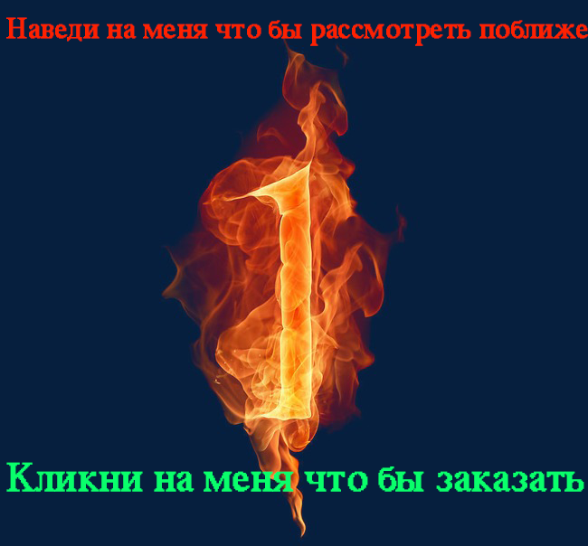</a>           
        <a id="fhoto1" class="tr" href="#">Кликни что бы посмотреть 1 фото</a>
        <a id="fhoto2" class="tr" href="#">Кликни что бы посмотреть 2 фото</a>
        <a id="fhoto3" class="tr" href="#">Кликни что бы посмотреть 3 фото</a>
    

,<button id="OBRAZBUT"></button>
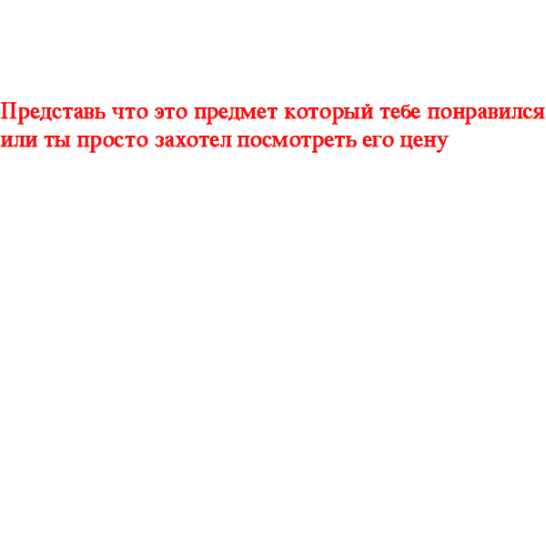
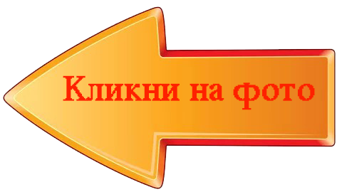
<a href="#" id="SOS" class="SOS">Как здесь заказывать</a>

</body>

</html>
